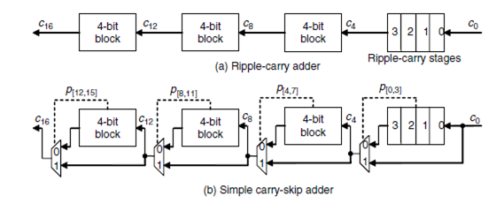

# Carry-Skip Adder 32-bit

## Overview
This project implements a **32-bit Carry-Skip Adder** with a variable number of propagate groups. The implementation is done in **VHDL**, and the project includes theoretical analysis, simulation results, and performance comparisons.

## Features
- **Carry-Skip Adder** design to improve addition speed over traditional Ripple Carry Adders.
- **Parametric block size** to optimize delay performance.
- **VHDL implementation** with modular components.
- **Simulation results** and comparison with a Ripple Carry Adder.

## Main Structure
Below is the block diagram of the Carry-Skip Adder structure:

## Files
- `Carry_Skip_Adder_32bit.vhd`: Main adder module.
- `Adder_Block.vhd`: Component for addition within each block.
- `Full_Adder.vhd`: Basic full-adder circuit.
- `MUX_2x1.vhd`: Multiplexer used for carry propagation.
- `Calc_Propagate.vhd`: Module that determines carry propagation.

## How to Run
1. Open **ModelSim** or another VHDL simulator.
2. Compile all VHDL files.

## Results
- The Carry-Skip Adder reduces propagation delay compared to a Ripple Carry Adder.
- The optimal block size was determined to be **4-bit** for minimal delay.
- Simulation confirms correct functionality and efficiency.

## Conclusion
The **Carry-Skip Adder** provides an efficient method for fast addition, especially for large bit-width numbers. It balances speed and complexity, making it ideal for applications requiring rapid arithmetic operations.
